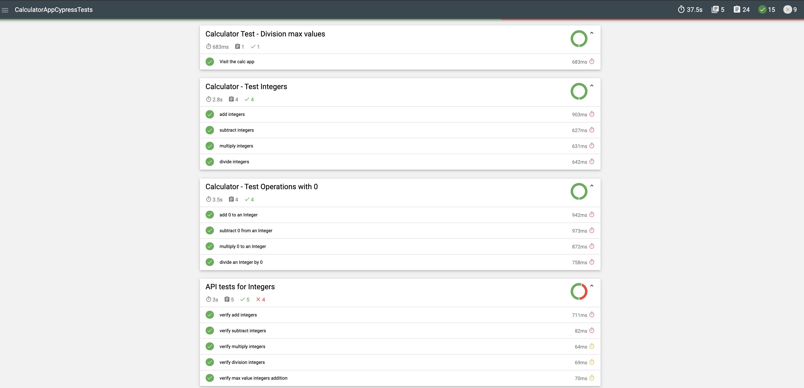
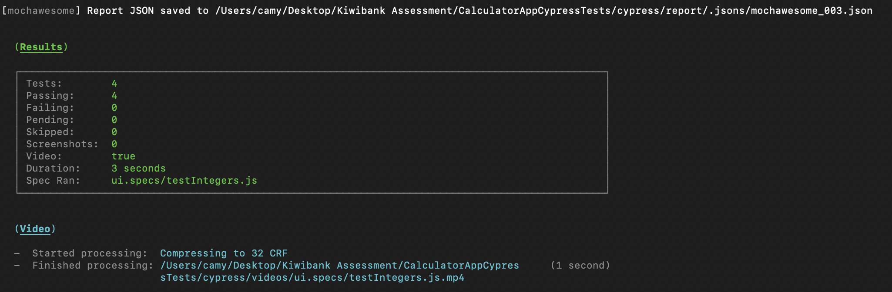
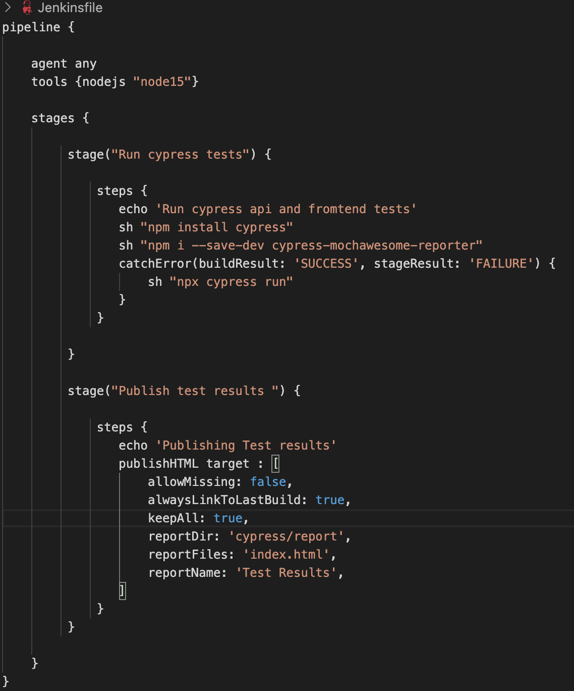
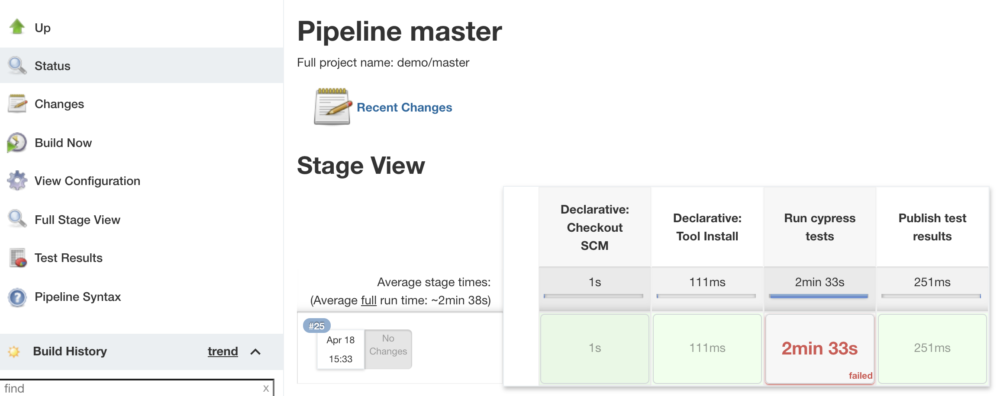
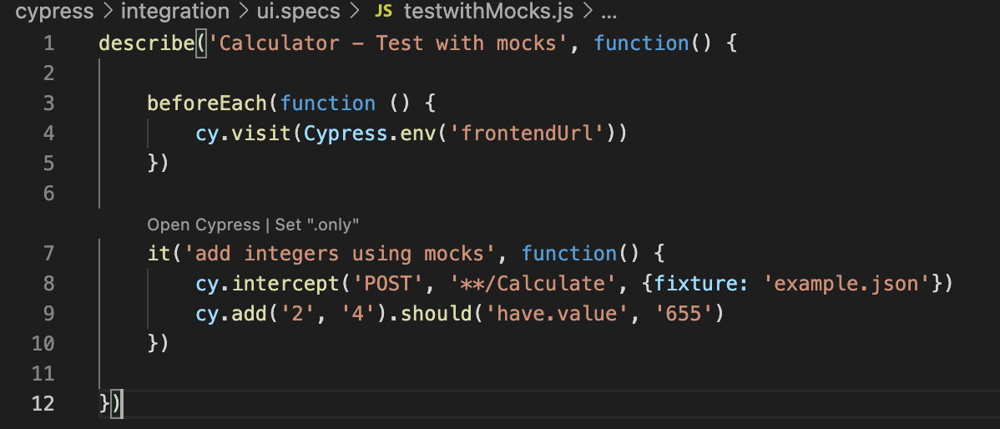
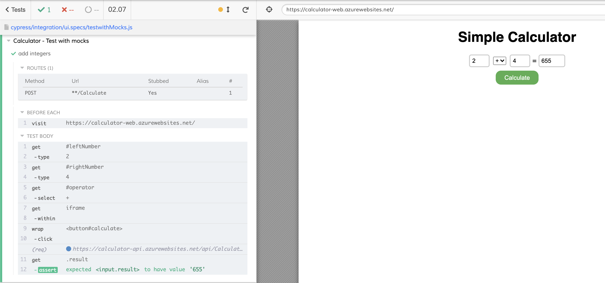

# Calculator App Cypress Tests
This readme explains how to run front end and api tests for Calculator app and the REST endpoint.

## Getting started:
1. Make sure you have node.js installed on your local
2. Checkout out the git repo: **git clone https://github.com/camy04/calculatorCypressTests.git**
3. On terminal run: **npm install cypress --save-dev'** this will install Cypress locally as a dev dependency for your project
4. On terminal run **'npm init'** : this will initialize the project and create a package.json for the project
5. Make sure you read through the test reports part of the readme file, so that you dont miss out installing the required dependencies for test reports else the project might fail to run

## Editing the project/tests: 
1. You can use Visual Studio code to view the project locally and edit it
2. To enable editing support for cypress in VSC, install the following extensions: 'Cypress Helper' and 'Cypress Snippets'

## Running tests using cypress test runner
1. To run tests via a GUI interface, on terminal run **npx cypress open**.  
   This will launch the Cypress test runner where you can choose to either run the invidual spec/tests files or the whole suite
   Please note that in a cypress based project all the tests/specs should reside withing **integration** folder.
   

## Running tests from CLI

### To run the entire test suite from CLI use:
 **npx cypress run**  
By default, Cypress run will run all tests headlessly in the Electron browser.
 Please note this will run every tests inside the integration folder

### To run a specific spec file from CLI use:
 **npx cypress run --spec "cypress/integration/api.spces/apiTests.js'**  
apiTests.js is our example spec file in this case that we want to run from command line

## Test Reports
1. Because Cypress is built on top of Mocha, that means any reporter built for Mocha can be used with Cypress
2. For this project we've choosen **cypress-mochawesome-reporter** as it gives us beautiful html reports which are very easy to read
3. To install cypress-mochawesome-reporter, follow the installation step by step guide here: [cypress-mochawesome-reporter](https://www.npmjs.com/package/cypress-mochawesome-reporter)
4. This will create a report folder in the cypress dir and record the test results into **index.html**  
   Here is a sample test report generated by cypree-mochawesome-reporter  
    
   

## Screenshots
1. Cypress comes with the ability to take screenshots, whether you are running via cypress open or cypress run
2. To take screenshots only when test fails, we've added **screenshotOnRunFailure** key to our cypress.json config and set the value to true 
3. Screenshots are stored in the screenshotsFolder which is set to cypress/screenshots by default.
4. The screenshot config setting doesn't apply to cypress test runner so when running cypress tests locally, we'll have to use cypress run instead of cypress open.  
For eg: **npx cypress run --spec "cypress/integration/api.spces/apiTests.js'** 

## Videos
1. Cypress records a video for each spec file when running tests during cypress run. Videos are not automatically recorded during cypress open.  
2. Videos are stored in the videosFolder which is set to cypress/videos by default.  
3. After cypress run completes, Cypress automatically compresses the video in order to save on file size. By default it compresses to a 32 CRF, but this is configurable with the videoCompression property.
4. When using the --record flag while running your tests, videos are processed, compressed, and uploaded to the Dashboard Service after every spec file runs, successful or not. To change this behavior to only process videos in the case that tests fail, set the videoUploadOnPasses configuration option to false.
5. Cypress clears any existing videos before a cypress run. If you do not want to clear your videos folder before a run, you can set trashAssetsBeforeRuns to false.
   [source - cypress docs](https://docs.cypress.io/guides/guides/screenshots-and-videos#Videos)
   Here is an example from one of our local runs that shows video being processed when using cypress run:
   

## Retries
1. Cypress supports retrying failed tests for both open and run mode
2. The number of retries can be aded into cypress.json as shown below:
   
   Here is an example from a cypress test runner run. Attempt 1 and Attempt 2 showcase the test was retried once more after failing the first time
   

## Running tests on CI (Jenkins):
1. I've provided a sample Jenkins declarative pipeline which will run all the tests inside integration folder and then publish the mochaawesome test results as a build artifact
   
   

## Using stubs to intercept network calls
1. In Cypress, the best practice is to add all your stubs/mocks json responses into cypress/fixtures dir
2. For this project, we've mocked the response for Calculate endpoint and have added it as example.json under fixtures
3. To intercept a network call so that you can replace the actual enpoint response with your mock, we use **cypress.intercept()**  
   Here is an example that shows how I've done it for POST request to calculate endpoint  
   

   Here's how it looks in action in cypress test runner:  
   

## Cross browser testing
By default, cypress run will run our tests on a headless electron browser but we can give --browser argument to run tests on a different browser

For eg: To run our tests on a Firefox broswer, we need to make sure we have Mozilla Firefox installed on our local and then from terminal run:  
**npx cypress run --browser firefox**  
OR to run tests on chrome, make sure you have Google chrome installed and from terminal run:  
**npx cypress run --browser chrome**

