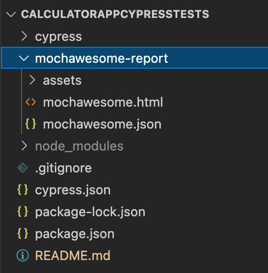

# Calculator App Cypress Tests
This readme explains you how to run front end and api tests for Calculator app and the REST endpoint.

## Getting started:
1. Make sure you have node.js installed on your local
2. Checkout out the git repo: 'git clone https://github.com/camy04/calculatorCypressTests.git'
3. On terminal run: **npm install cypress --save-dev'** this will install Cypress locally as a dev dependency for your project
4. On terminal run **'npm init'** : this will initialize the project and create a package.json for the project

## Editing the project/tests: 
1. You can use Visual Studio code to view the project locally and edit it
2. To enable editing support for cypress in VSC, install the following extensions: 'Cypress Helper' and 'Cypress Snippets'

## Running tests using cypress test runner
1. To run tests via a GUI interface, on terminal run **npx cypress open**.  
   This will launch the cypress test runner where you can choose to either run the invidual spec/tests files or the whole suite
   Please note that in a cypress based project all the tests/specs should reside withing 'integration' folder.
   

## Running tests from CLI
### To run the entire test suite from CLI use:
 **npx cypress run**  
By default, cypress run will run all tests headlessly in the Electron browser.
 Please note this will run every tests inside the integration folder

### To run a specific spec file from CLI use:
 **npx cypress run --spec "cypress/integration/api.spces/apiTests.js'**  
apiTests.js is our spec file in this case that we want to run from command line

## Test Reports
1. Because Cypress is built on top of Mocha, that means any reporter built for Mocha can be used with Cypress
2. For this project we've choosen **mochawesome** reporter as it gives us beautiful html reports which are very easy to read.
3. To enable mochawesome reporter, we've added **reporter** key to our config.json and set the value to **mochawesome**
4. This will create a mochawesome-report folder in the root dir and record the test results in both html and json formats as shown in the image below
   
5. Here is how mochawesome report looks like:
   

## Screenshots
1. Cypress comes with the ability to take screenshots, whether you are running via cypress open or cypress run.
2. To take screenshots only when test fails, we've added **screenshotOnRunFailure** to our cypress.json config and set the value to true.  
3. Screenshots are stored in the screenshotsFolder which is set to cypress/screenshots by default.
4. The screenshot config setting doesn't apply to cypress test runner so when running cypress tests locally, we'll have to use cypress run instead of cypress open.  
For eg: **npx cypress run --spec "cypress/integration/api.spces/apiTests.js'** 

## Videos
1. Cypress records a video for each spec file when running tests during cypress run. Videos are not automatically recorded during cypress open.  
2. Videos are stored in the videosFolder which is set to cypress/videos by default.  
3. After cypress run completes, Cypress automatically compresses the video in order to save on file size. By default it compresses to a 32 CRF, but this is configurable with the videoCompression property.
4. When using the --record flag while running your tests, videos are processed, compressed, and uploaded to the Dashboard Service after every spec file runs, successful or not. To change this behavior to only process videos in the case that tests fail, set the videoUploadOnPasses configuration option to false.
5. Cypress clears any existing videos before a cypress run. If you do not want to clear your videos folder before a run, you can set trashAssetsBeforeRuns to false.

## Dashboard
## Running tests on CI (Jenkins):

